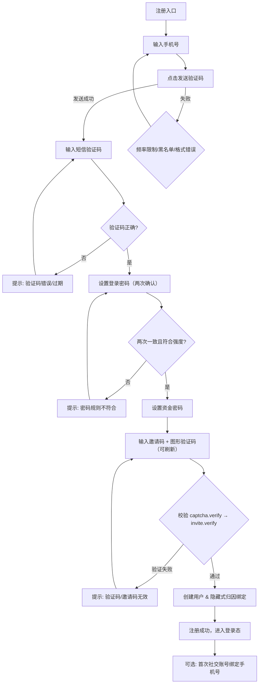

《港股+虚拟资产综合交易平台 · PRD v1–v7（汇编版）》

**"Hong Kong Stocks + Virtual Assets Integrated Trading Platform · PRD v1–v7 (Compiled Edition)"**

**版本 / Version**: 1.0  
**日期 / Date**: 2025-09-26  
**作者 / Owner**: 产品组（中英对照） / Product Team (CN/EN)

---

## 目录 / Table of Contents

- [0. 文档说明 / Document Notes](#0-文档说明--document-notes)
- [1. 全局规范 / Global Conventions](#1-全局规范--global-conventions)
- [2. PRD v1 · 注册 & 登录 / Registration & Login](#2-prd-v1--注册--登录--registration--login)
- [3. PRD v2 · 钱包 & 资金 / Wallet & Funds](#3-prd-v2--钱包--资金--wallet--funds)
- [4. PRD v3 · 交易（证券/现货/合约） / Trading (Securities/Spot/Futures)](#4-prd-v3--交易证券现货合约--trading-securitiesspotfutures)
- [5. PRD v4 · 会员 & 代理 & 邀请码 / Membership & Agent & Invite](#5-prd-v4--会员--代理--邀请码--membership--agent--invite)
- [6. PRD v5 · 项目方（发币/上币/融资/空投） / Project (Token/Listing/IEO/Airdrop)](#6-prd-v5--项目方发币上币融资空投--project-tokenlist ingieoairdrop)
- [7. PRD v6 · 平台后台（风控/清算/合规/活动） / Admin (Risk/Clearing/Compliance/Activities)](#7-prd-v6--平台后台风控清算合规活动--admin-riskclearingcomplianceactivities)
- [8. PRD v7 · 报表/通知/系统服务 / Reports/Notifications/System Services](#8-prd-v7--报表通知系统服务--reportsnotificationssystem-services)
- [9. 错误码总表 / Error Codes Summary](#9-错误码总表--error-codes-summary)
- [10. 术语表 / Glossary](#10-术语表--glossary)
- [附录 A · 线框图（Mermaid） / Appendix A · Wireframes (Mermaid)](#附录-a--线框图mermaid--appendix-a--wireframes-mermaid)

---

## 0. 文档说明 / Document Notes

- **目的 / Purpose**: 本文将 v1–v7 各章 PRD 汇编成单一文档，统一编号、目录与表格样式，便于评审、开发、测试与合规审计。  
  To compile PRD chapters v1–v7 into a single, consistently numbered doc for review, development, testing, and compliance.
- **范围 / Scope**: 注册&登录、钱包&资金、交易、会员&代理&邀请码、项目方、平台后台、报表/通知/系统服务。
- **不包含 / Out of Scope**: 品牌视觉稿、法务合同文本、第三方供应商具体报价。
- **格式 / Format**: Markdown（支持自动目录与 Mermaid 线框图）。
- **变更记录 / Changelog**:
  - v1.0 (2025-09-26): 首次汇编 / Initial compilation.

## 1. 全局规范 / Global Conventions

- **鉴权 / Auth**: 用户端 JWT（Access/Refresh）；后台 RBAC。
- **时区/币种 / TZ&Ccy**: UTC+0 存储，前端按用户/租户时区展示；USDT 为基准币。
- **幂等 / Idempotency**: 写操作携带 `Idempotency-Key`；5 分钟内去重。
- **分页 / Pagination**: `page,size,sort`；导出走异步任务 + 通知中心下载。
- **状态词典 / Status Dict**: `pending/approved/rejected/active/disabled/expired/failed/success`。
- **错误码命名 / Error Codes**: `MODULE_REASON`，统一英文码 + 中文文案。
- **安全要点 / Security**: 强制图形验证码在注册/登录/找回/改密/提现；提现白名单 + 冷却；KYT/制裁名单在注册、KYC、提现、上币前置检查。

# 2. PRD v1 · 注册 & 登录 / Registration & Login

## 2.1 模块概述 / Overview

- **目标 / Goal**  
  提供安全、合规、便捷的注册与登录体验，以手机号为唯一注册入口，并支持第三方社交账号授权登录（QQ、Facebook、Google）。
  
- **范围 / Scope**  
  手机号注册、短信验证码验证、登录、找回密码、资金密码设置与重置、社交账号绑定、2FA 管理。
  
- **不做 / Not included**
  
  - 2FA 备用恢复码
    
  - 设备指纹
    

---

## 2.2 业务规则 / Business Rules

1. **手机号注册**
  
  - 注册必须使用手机号；
    
  - 系统发送短信验证码，用户输入验证；
    
  - 注册需校验验证码正确性与时效性。
    
2. **密码设置**
  
  - 登录密码需输入两次以确认一致；
    
  - 单独设置资金密码（用于提现/交易），必须与登录密码区分；
    
  - 密码规则：长度 ≥ 8 位，必须包含大小写字母+数字。
    
3. **邀请码**
  
  - 注册时必填；
    
  - 服务端校验邀请码与租户/代理归因关系；
    
  - 前端不展示归因细节（隐藏式绑定）。
    
4. **图形验证码**
  
  - 注册、登录、找回密码、资金密码重置均需输入；
    
  - 图形验证码支持刷新；
    
  - 有效期 60 秒，错误 ≥ 3 次需刷新。
    
5. **社交账号授权登录**
  
  - 支持 QQ（邮箱授权）、Facebook、Google；
    
  - 首次授权必须绑定手机号（图形验证码 + 短信 OTP），完成后方可登录。
    
6. **登录限流**
  
  - 同一账号/IP 连续失败 ≥ 5 次，触发 `LOGIN_RATE_LIMITED`；
    
  - 触发后账号需等待冷却或通过找回密码流程解锁。
    
7. **找回密码**
  
  - 流程：手机号 → 图形验证码 → 短信 OTP → 设置新密码；
    
  - 新密码需符合复杂度要求，且与资金密码区分。
    
8. **资金密码重置**
  
  - 流程：手机号 → 图形验证码 → 短信 OTP → 设置新资金密码；
    
  - 必须与登录密码区分；
    
  - 重置成功后触发 **24h 提币冷却保护**。
    

---

## 2.3 页面 / Pages

- **/signup 注册页**  
  字段：手机号、短信验证码、登录密码（两次确认）、资金密码、邀请码、图形验证码  
  按钮：发送验证码、刷新图形验证码、提交  
  提示：验证码错误/过期、密码不一致、邀请码错误
  
- **/login 登录页**  
  字段：手机号、密码、图形验证码、（可选 OTP）  
  扩展：社交账号登录入口（QQ/Facebook/Google）  
  提示：账号或密码错误、验证码错误
  
- **/forgot 找回密码页**  
  字段：手机号、图形验证码、短信验证码、新密码（两次确认）  
  提示：成功后跳转登录页，显示绿色成功提示
  
- **/security 安全设置页**  
  功能：资金密码重置、2FA 绑定/解绑、退出所有会话  
  提示：解绑需额外 OTP 验证
  

---

## 2.4 流程图 / Flowcharts

### 注册流程



### 登录流程

```mermaid
flowchart TB
  A[登录入口] --> B[输入: 手机号/密码/图形验证码]
  B --> CAP{图形验证码有效?}
  CAP -- 否 --> CAP_ERR[提示: 验证码错误/过期] --> B
  CAP -- 是 --> CRED{手机号+密码正确?}
  CRED -- 否 --> CRED_ERR[提示: 账号或密码错误] --> B

  CRED -- 是 --> RATE{是否触发限流?}
  RATE -- 是 --> RL[提示: LOGIN_RATE_LIMITED] --> B
  RATE -- 否 --> TWOFA{是否开启2FA?}
  TWOFA -- 否 --> LOGIN[颁发Token → 登录成功]
  TWOFA -- 是 --> OTP[输入OTP(短信/Authenticator)]
  OTP --> OTP_OK{OTP正确?}
  OTP_OK -- 否 --> OTP_ERR[提示: OTP错误/过期] --> OTP
  OTP_OK -- 是 --> LOGIN

  A --> SSO[社交登录: QQ/Facebook/Google]
  SSO --> SSO_AUTH{授权成功?}
  SSO_AUTH -- 否 --> SSO_ERR[提示: SOCIAL_AUTH_FAILED] --> SSO
  SSO_AUTH -- 是 --> BIND{是否首次授权?}
  BIND -- 否 --> LOGIN
  BIND -- 是 --> PH[绑定手机号: 手机号+验证码]
  PH --> PH_OK{校验通过?}
  PH_OK -- 否 --> PH_ERR[提示: 验证失败] --> PH
  PH_OK -- 是 --> LINK[创建/绑定账号] --> LOGIN

```

### 找回密码流程

```
flowchart TB
  A[找回密码入口] --> P[输入手机号]
  P --> C[图形验证码]
  C --> CAP{验证码有效?}
  CAP -- 否 --> CAP_ERR[提示: 验证码错误/过期] --> C
  CAP -- 是 --> SND[发送短信验证码]
  SND --> SND_OK{发送成功?}
  SND_OK -- 否 --> SND_ERR[提示: 频率限制/黑名单] --> SND
  SND_OK -- 是 --> V[输入短信验证码]

  V --> SMS_OK{短信验证码正确?}
  SMS_OK -- 否 --> SMS_ERR[提示: 验证码错误/过期] --> V
  SMS_OK -- 是 --> NP[设置新登录密码(两次确认)]
  NP --> PWD_OK{两次一致且符合强度?}
  PWD_OK -- 否 --> PWD_ERR[提示: 密码规则不符合] --> NP
  PWD_OK -- 是 --> DONE[重置成功 → 跳转登录页]

```

### 资金密码重置流程

```
flowchart TB
  A[资金密码重置入口] --> P[输入手机号]
  P --> C[图形验证码]
  C --> CAP{验证码有效?}
  CAP -- 否 --> CAP_ERR[提示: 验证码错误/过期] --> C
  CAP -- 是 --> SND[发送短信验证码]
  SND --> SND_OK{发送成功?}
  SND_OK -- 否 --> SND_ERR[提示: 频率限制/黑名单] --> SND
  SND_OK -- 是 --> V[输入短信验证码]

  V --> SMS_OK{短信验证码正确?}
  SMS_OK -- 否 --> SMS_ERR[提示: 验证码错误/过期] --> V
  SMS_OK -- 是 --> FP[设置新资金密码]
  FP --> FP_OK{符合强度且≠登录密码?}
  FP_OK -- 否 --> FP_ERR[提示: 不得与登录密码相同] --> FP
  FP_OK -- 是 --> DONE[重置成功 → 启动24h提币冷却保护]

```

---

## 2.5 接口 / APIs

- **Captcha**
  
  - `GET /api/captcha/generate`
    
  - `POST /api/captcha/verify`
    
- **短信验证码**
  
  - `POST /api/sms/send {phone,scene}`
    
  - `POST /api/sms/verify {phone,code}`
    
- **注册**
  
  - `POST /api/user/register {phone,smsCode,password,confirmPassword,fundPassword,inviteCode,captchaId,captchaCode}`
- **登录**
  
  - `POST /api/user/login {phone,password,captchaId,captchaCode,otp?}`
    
  - `POST /api/user/login/social {provider:qq|facebook|google, token, phone?}`
    
- **找回/重置密码**
  
  - `POST /api/user/forgot`
    
  - `POST /api/user/reset`
    
- **资金密码**
  
  - `POST /api/user/fundpwd/reset {phone,smsCode,captchaId,captchaCode,newFundPwd}`
- **2FA**
  
  - `POST /api/user/2fa/{bind|unbind}`
- **会话管理**
  
  - `POST /api/user/session/terminate_all`

---

## 2.6 错误码 / Errors

- `SMS_REQUIRED / SMS_INVALID / SMS_EXPIRED` → 短信验证码错误
  
- `PASSWORD_MISMATCH` → 登录密码两次输入不一致
  
- `FUND_PASSWORD_REQUIRED` → 未设置资金密码
  
- `INVITE_REQUIRED / INVITE_NOT_FOUND / INVITE_EXPIRED / INVITE_TENANT_MISMATCH` → 邀请码无效
  
- `CAPTCHA_REQUIRED / CAPTCHA_INVALID / CAPTCHA_EXPIRED` → 图形验证码无效
  
- `LOGIN_RATE_LIMITED` → 登录限流
  
- `SOCIAL_AUTH_FAILED` → 社交授权失败
  
- `SOCIAL_BIND_REQUIRED` → 首次社交登录必须绑定手机号
  

---

## 2.7 测试要点 / Tests

- 手机号注册与短信验证码验证
  
- 登录密码两次确认 + 强度校验
  
- 资金密码与登录密码区分校验
  
- 图形验证码刷新与过期校验
  
- 邀请码服务端隐藏校验
  
- 社交账号授权登录流程（QQ/Facebook/Google），首次绑定手机号强制校验
  
- 登录限流场景
  
- 找回密码完整流程
  
- 资金密码重置触发 24h 冷却保护